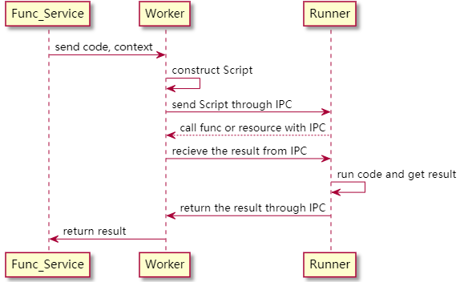

# vmbox 
  
  [中文版](./README.zh.md)

  vmbox is a `security sandbox` born to solve the insecureness of node's vm module, which can be used to run untrusted js code

  Node provides a vm module to run js code, but it is not safe and cannot be used to run untrusted code.
  > The vm module is not a security mechanism. Do not use it to run untrusted code
  
  The community has provided vm2 with the ability to run unsafe code and to defend against all known attack methods. But the problem of [asynchronous endless loop] (https://github.com/patriksimek/vm2/issues/180) still exists.

  vmbox uses child process isolation and encapsulates [vm2](https://github.com/patriksimek/vm2) to solve the problem of asynchronous endless loop.

## Feature

  * forced exit in an endless loop (kill child process in an endless loop)
  * cross-process function call (using IPC cross-process call function)
  * functions call each other (inter-function calls with the help of context)
  * internal task queue
  * process autonomy (killed since startup)
  * return promise

## Installation

```
npm install vmbox --save
```

## Quickstart

```javascript
const VMBox = require('vmbox');
const vmBox = new VMBox({
  timeout: 100,
  asyncTimeout: 500
});

const fn = `a = 10`;
vmBox.run(fn).then(console.log)
// 打印10
```
`timeout` is the limit execution time for synchronous code, default 100ms  
`asyncTimeout`is the limit execution time for asynchronous code, default 500ms

## Documentation
  - [background](#background)
  - [vm2](#vm2)
  - [usage](#usage)
  - [principle](#principle)
  - [contributing](#contributing)

## background
There are a large number of independent js functions in the project that are converted into APIs to provide external services and provided to multiple project calls. It was decided to use the idea of faas to transform the functions into API services. vmbox is the core function of building a simple faas without a cloud vendor.

Project survey found that the current nodejs provided vm and community vm2 are some problems for the security and stability of the service, to vm2 conducted business package.

vmbox is used to run online services, so the function is required to be as single as possible and less dependent, to ensure that vmbox reduces timeouts (restarting processes requires a large amount of cpu resources) and good performance.

## vm2

vm2 is very powerful, vmbox encapsulates the most basic functions of vm2, only supports context function injection, and does not support node built-in modules and custom modules.

```javascript
// innernal vm2 usage
const { VM } = require('vm2');
const vm = new VM({ timeout, sandbox });
const result = await vm.run(code);
```

## usage
The vmbox instance has only one `run` method, and the return value is a` promise`, receiving three parameters

| param name | type | required | default | introduction |
|---|---|---|---|---|
|code|string| true | - | js code to run|
|context| object | false | {} | function execution context |
|stack | boolean | false | false | call other functions within the function and record the function call stack|

If the code runs incorrectly, an exception will be thrown by Promise.reject (error), and the exception needs to be caught

**basic usage**

```javascript
const VMBox = require('vmbox');
const vmBox = new VMBox({
  timeout: 100,
  asyncTimeout: 500
});

const context = {
  sum(a, b){
    return a + b;
  }
}

const fn = `sum(2, 3)`

vmBox.run(fn).then(console.log)
// log 5
```

**advanced usage**

There are many things you can do with the help of a function execution context. Here is a method that calls other functions from inside the function.

```javascript
const VMBox = require('vmbox');
const vmBox = new VMBox({
  timeout: 100,
  asyncTimeout: 500
});

const fnGroup = {
  sum: `async function main({params, fn}){
    const {a, b} = params;
    return a + b
  }`,
  caller: `async function main({params, fn}){
    return await fn.call('sum', params);
  }`
};

async function run(code, context, stack = false) {
  const runCode = code + `;\n(async () => { return await main({params, fn}); })()`
  return vmBox.run(runCode, context, stack);
}

const fn = {
  call: (name, params) => {
    const code = fnGroup[name];
    if (code) {
      return run(code, { params, fn }, true);
    } else {
      return null;
    }
  }
}

const context = {
  fn,
  params: {
    a: 10,
    b: 20
  }
}

const code = fnGroup.caller;
try {
  const res = await run(code, context);
  console.log(res); // 打印30
} catch (error) {
  console.log(error);
}
```
If the functions call each other, a closed loop of calls may be formed. If the running is not completed for 500ms, the execution child process will be killed and a new child process will be started.

## principle

1. `Func_Service` is a service
2. `Worker`和`Runner`are part of vmbox
3. `Worker` run in the main process
4. `Runner` runs in a child process, the environment in which untrusted code runs

## contributing
This repository is used to build faas service. It is currently used in online projects. If you find a problem during use, you can submit an issue and we will fix it as soon as possible. If you have good suggestions for modification, you can submit a pull request, including issue and solution.
