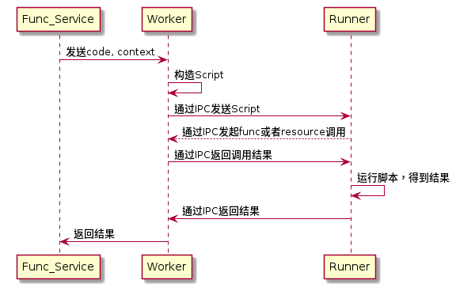

## 前沿
`VMBox`是为了解决node的`vm`模块不安全而诞生的`安全沙盒`，可以被用来运行不安全的js代码。非常感谢`VM2`所做出的的贡献。`VMBox`是在`VM2`的基础上增加了`进程`机制，解决了`异步死循环`的问题。

## 使用

### 简单使用
```javascript
const VMBox = require('VMBox');
const vmBox = new VMBox({
  timeout: 100,
  asyncTimeout: 500
});

const fn = `var a = 10`;

vmBox.run(fn).then(console.log)
// 打印10
```
`timeout`是代码同步执行的时间， 默认100ms
`asyncTimeout`限制代码异步执行的时间， 默认500ms
函数的使用可以参考`VM2`

### 注入函数上下文
```javascript
const context = {
  sum(a, b){
    return a + b;
  }
}

const fn = `sum(2, 3)`

vmBox.run(fn).then(console.log)
// 打印5
```
`context`中的方法和属性，会被注入到函数执行的上下文中，成为全局变量

### 异步死循环
```javascript
const context = {
  sum(a, b){
    return a + b;
  }
}
const fn = `async function main(){
    let res = await sum(2, 3);
    while(1){}
    return res;
  };main()`;

try {
  await vmBox.run(fn, context);
} catch (error) {
  console.log(error);
}
// 打印 running timeout, maybe the code is infinite loop
```
500ms内未执行完成，会kill `runner`，并重启一个新的`runner`

## 调用流程图

1. `Func_Service`是应用程序
2. `Worker`和`Runner`是VMBox的部分
3. `Worker` 运行在主进程中
4. `Runner` 运行在子进程中，即用户代码运行的环境